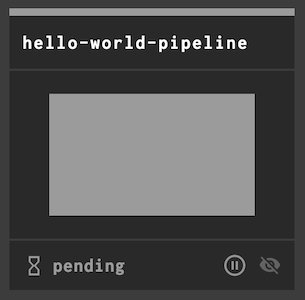
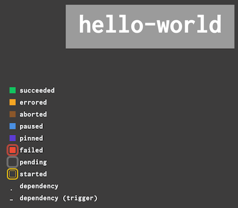

# Section 01 - Hello, World Pipeline

The goal of this section is to create your first pipeline in Concourse that prints `Hello, World!`. We're going to follow Concourse's best practices while we build this pipeline.

### Part One - Hello World Task

In this first part we're going to create a Concourse task and execute the task using the `fly` cli.

In the fork of this repo, make a folder called `ci` with following sub-folder structure.

```
ci
├── dockerfiles        # where docker files are stored
├── pipelines          # where pipeline config files are stored
└── tasks              # where task config files are stored
    └── scripts        # where scripts used by task files are are stored
```

Create a task file called `hello-world.yml` under `ci/tasks`.

```
touch ci/tasks/hello-world.yml
```

A task config has has three mandatory sections that need to be filled out: `platform`, `image_resoruce`, and `run`.

`platform`: tells Concourse which type of worker to run this `task` on. Our local Concourse has one `linux` worker. You can create `windows` and `darwin` workers as well.

```yaml
platform: linux
```

`image_resource`: what container image the `task` should run inside of. Every `task` that Concourse runs must be run inside a container image. There is _default_ container image that Concourse uses. You must tell Concourse exactly which container image to use. You can use any image up on Docker Hub or a local image registry that you have access to.

We'll have our task run inside the `alpine` image from Docker Hub. We'll talk about the `type: registry-image` field in a later chapter.

> NOTE: Concourse only cares about the filesystem that comes from the container image from Docker Hub. All `CMD` and `ENTRYPOINT` commands are not passed along to Concourse to execute.

```yaml
image_resource:
  type: registry-image
  source:
    repository: alpine
```

`run`: Concourse will run the executable and arguments passed in this section, capturing all `stdout` and `stderr`. The exit status of the executable is how Concourse determines if the `task` was successful or not.

```yaml
run:
  path: echo
  args:
    - "Hello, World!"
```

Put together, our task config should look like this.

```yaml
platform: linux

image_resource:
  type: registry-image
  source:
    repository: alpine

run:
  path: echo
  args:
    - "Hello, World!"
```

Let's run it using the `fly execute` command.

```
$ fly -t local execute --config ci/tasks/hello-world.yml
uploading concourse-tutorial done
executing build 1 at http://localhost:8080/builds/1
initializing
fetching alpine@sha256:acd3ca9941a85e8ed16515bfc5328e4e2f8c128caa72959a58a127b7801ee01f
9d48c3bd43c5 [==========================================] 2.7MiB/2.7MiB
running echo Hello, World!
Hello, World!
succeeded
```

If we run the task again, we won't see the the alpine image being downloaded. Concourse caches container images used by tasks.

```
$ fly -t local execute --config ci/tasks/hello-world.yml
uploading concourse-tutorial done
executing build 2 at http://localhost:8080/builds/2
initializing
running echo Hello, World!
Hello, World!
succeeded
```

Now let's further break down the task config by putting the `echo Hello, World!` into its own file. This is very useful for when you have large scripts. Embedding scripts inside your task config is handy but can start looking ugly if your script is large.

In the `ci/tasks/scripts` folder create a file called `hello-world.sh` and make it executable.

```
touch ci/tasks/scripts/hello-world.sh && chmod +x ci/tasks/scripts/hello-world.sh
```

Populate the script with the following.

```
#!/bin/sh
echo Hello, World!
```

Locally you should be able to run it.

```
./ci/tasks/scripts/hello-world.sh
Hello, World!
```

This is the script we'll run to get Concourse to say "Hello, World!".

Now we have to tell Concourse about how to run this script from the task config. Let's modify our task config so it runs our script. 

```yaml
platform: linux

image_resource:
  type: registry-image
  source:
    repository: alpine

inputs:
  - name: repo

run:
  path: repo/ci/tasks/scripts/hello-world.sh
```

We update the `run` section to instead call our `hello-world.sh` script. We also added a new section here called `inputs`. 

`inputs` is where we tell Concourse what volumes we want mounted into this task's container. All volumes that concourse mounts are placed in the working directory of the container. `inputs` can come from other tasks and we'll see how that's done later. Using `fly` we can pass volumes to concourse based on local folders that we have. We'll pass in this repo as a volume using the `--input` flag. Concourse will then mount our volume under `./repo` inside the container.

```
$ fly -t local execute --config ci/tasks/hello-world.yml --input repo=.
uploading repo done
executing build 3 at http://localhost:8080/builds/3
initializing
running repo/ci/tasks/scripts/hello-world.sh
Hello, World!
succeeded
```

Congratulations! You successfully ran a task on Concourse! Next, let's see how we put this task into a pipeline.

### Part Two -  Jobs & Steps

In this part, we're going to take the previous task config and script, and put them into a single pipeline config file, `hello.yml`. After we create and run that pipeline we'll split them up again into three files: `hello.yml`, `hello-world.yml`, and `hello-world.sh`.

Create a YAML file called `hello.yml` in `ci/pipelines`.

```
touch ci/pipelines/hello.yml
```

Let's add a `jobs` section to our pipeline's config, which contains a list of jobs. We only have one job so it's a short list.

```yaml
jobs:
  - name: hello-world
```

We've created a job and now we need to describe to Concourse what our job should do. We do this in the `plan` section of a job. A `plan` takes a list of `steps` that run in the order they're listed in. We'll add a `task` step called `hello-world-task` as the only step in our `plan`.

```yaml
jobs:
  - name: hello-world
    plan:
      - task: hello-world-task
```

A `task` step has a mandatory `config` section. The `config` section tells Concourse how to run a `task` step. You can do **anything** inside a `task` section that you can do from your terminal. You can copy-paste the task config from `ci/tasks/hello-world.yml` file under the `config` key.

```yaml
config:
  platform: linux
  image_resource:
    type: registry-image
    source:
      repository: alpine
  run:
    path: echo
    args:
      - "Hello, World!"
```

Let's put all the above YAML bits into our `hello.yml`:

```yaml
jobs:
  - name: hello-world
    plan:
      - task: hello-world-task
        config:
          platform: linux
          image_resource:
            type: registry-image
            source:
              repository: alpine
          run:
            path: echo
            args:
              - "Hello, World!"
```

Our pipeline is now done. We can create the pipeline in Concourse and run it.

To create a pipeline in Concourse, we just pass in our YAML file. This is also where we tell Concourse what to name our pipeline. The name of a pipeline doesn't exist in the pipeline's YAML, it is always set during creation of the pipeline. Concourse will prompt you to confirm the configuration, enter `y` to continue.

```
$ fly -t local set-pipeline --pipeline hello-world-pipeline --config hello-world-pipeline.yml
jobs:
  job hello-world has been added:
+ name: hello-world
+ plan:
+ - config:
+     container_limits: {}
+     image_resource:
+       source:
+         repository: alpine
+       type: registry-image
+     platform: linux
+     run:
+       args:
+       - Hello, World!
+       path: echo
+   task: hello-world-task

apply configuration? [yN]: y
pipeline created!
you can view your pipeline here: http://localhost:8080/teams/main/pipelines/hello-world-pipeline

the pipeline is currently paused. to unpause, either:
  - run the unpause-pipeline command:
    fly -t local unpause-pipeline -p hello-world-pipeline
  - click play next to the pipeline in the web ui

```

You'll now have a link to your pipeline, [http://localhost:8080/teams/main/pipelines/hello-world-pipeline](http://localhost:8080/teams/main/pipelines/hello-world-pipeline). When a pipeline is created it is paused by default. This only happens the first time you set a pipeline. Updating a pipeline does not pause it. 

You can unpause the pipeline by running `fly -t local unpause-pipeline -p hello-world-pipeline` or hitting the play button in the web UI for the pipeline.


After unpausing:



If you click on the header of the pipeline's dashboard box, where it says `hello-world-pipeline`, you'll get a view of the jobs (in our case, singular job) in the pipeline. The colour of a job's box shows the result of the last run of that specific job. A job is is coloured grey when it has never been run before. There's a legend in the bottom left corner to describe the other possible states.



To run our `hello-world-pipeline` we need to trigger the `hello-world` job. You can trigger the `hello-world` job using `fly` or the web UI. For `fly` you can run

```
fly -t local trigger-job -p hello-world-pipeline/hello-world
```

To trigger the job from the web UI, click on the job (from the dashboard or pipeline page) and press the plus button (`+`) in the top-right corner. This will trigger a new `build` for our `hello-world` job. Each time a job is ran, Concourse logs that as a `build`.

You'll notice a large red `x` appear beside the plus button. Pressing that button will abort the current build for the job, if the build's state is `pending` or `started`. From this screen we're able to see each step in our job run along with the `stdout` and `stderr`.

If you click on the black bar that says `hello-world-task` you should see the following output with timestamps to the left.

```
Hello, World!
```

It worked! The colour of the `hello-world` job should now be green, indicating that the last build was successful (had an exit status of `0`).

In the next part we'll automate the running of the pipeline and split up the pipeline into three files: a pipeline config, task config, and task script.

### Part Three - Resources TODO

Right now, this pipeline is 100% manual. It will never automatically run for any reason. It only runs when someone presses the trigger button for the job. Let's change that! Let's say "Hello, World!" every minute, because that's how much we like saying "Hello" to the world!

Open up the `hello-world-pipeline.yml` and add a new top-level section called `resources`. Like the `jobs` section of the pipeline, `resources` takes in a list of resources.

```yaml
jobs:
  - name: hello-world
    plan:
      - task: hello-world-task
        config:
          platform: linux
          image_resource:
            type: registry-image
            source:
              repository: alpine
          run:
            path: echo
            args:
              - "Hello, World!"

resources:
  - name: every-minute
    type: time
    icon: clock-outline
    source:
      interval: 1m
```

In the updated pipeline YAML, we've added one resource object. Concourse comes with a couple default resource types bundled in the Concourse binary, the `time` resource being one of the defaults. Other resources can be downloaded or added manually to linux workers. We'll talk more about resources later. You can find a list of resources [here](https://github.com/concourse/concourse/wiki/Resource-Types). The git repository for the time resource is [here](https://github.com/concourse/time-resource).

For now the important thing to know is that `resources` in Concourse emit `version` objects. What a "version" object is depends on the resources implementation. For the `time` resource, a new version object is created at the interval we specify. So every minute our `every-minute` time resource will emit a new version object.

Now that we defined our `resource` we can use it to automatically trigger the job in our pipeline. We do this by adding a `get` step to our job's `plan`. Setting `trigger: true` for a `get` step means whenever a new version from `every-minute` is emitted Concourse will trigger the job this `get` step is part of.

```yaml
jobs:
  - name: hello-world
    plan:
      - get: every-minute
        trigger: true
      - task: hello-world-task
        config:
          platform: linux
          image_resource:
            type: registry-image
            source:
              repository: alpine
          run:
            path: echo
            args:
              - "Hello World!"

resources:
  - name: every-minute
    type: time
    icon: clock-outline
    source:
      interval: 1m
```

Let's set our updated pipeline.

```
$ fly -t local set-pipeline -p hello-world-pipeline -c hello-world-pipeline.yml
resources:
  resource every-minute has been added:
+ icon: clock-outline
+ name: every-minute
+ source:
+   interval: 1m
+ type: time

jobs:
  job hello-world has changed:
  name: hello-world
  plan:
+ - get: every-minute
+   trigger: true
  - config:
      container_limits: {}
      image_resource:
        source:
          repository: alpine
        type: registry-image
      platform: linux
      run:
        args:
        - Hello World!
        path: echo
    task: hello-world-task

apply configuration? [yN]: y
configuration updated
```


They're connected! The `hello-world` job should trigger every minute now.

To recap what we did:

1. Created a `time` resource called `every-minute` that emits a new version object every minute
2. Connected the `every-minute` resource to our `hello-world` job by adding a `get` step to our job's plan


That's it for our `hello-world-pipeline`. You should have a basic idea of how jobs and resources work together to automatically run "things". The following sections will dig into each of these concepts with more detail and also show you best practices for structuring your pipeline's code within your existing codebase.
